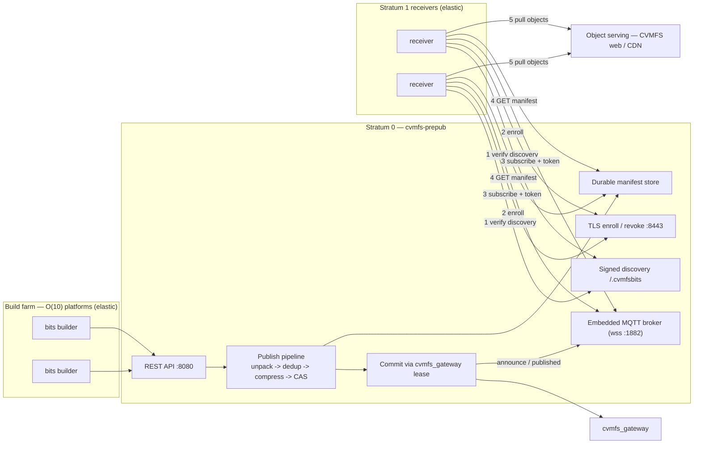

# cvmfs-prepub

A fast, resilient Go service that pre-processes software releases and publishes
them into [CVMFS](https://cernvm.cern.ch/fs/) **without holding the repository
transaction lock during file processing**, then distributes them to Stratum 1
replicas over an **authenticated, pull-based control plane (WebSocket + TLS)**.

> **This README describes the current system: the bits publish pipeline plus the
> pull-over-wss path for authentication and coordination.** Earlier push / SSE /
> external-broker options still exist in the tree but are deprecated; they are
> summarised in [REFERENCE.md Part VIII §46](REFERENCE.md). For the full design,
> diagrams, and security model see [REFERENCE.md Part VIII](REFERENCE.md).

## The problem

The standard CVMFS workflow holds an exclusive Stratum 0 lock for the whole of
tar extraction, compression, hashing, and CAS upload — serialising work that is
intrinsically parallel — and then leaves Stratum 1 replicas to fetch every new
object from scratch after the catalog flips.

## What it does

1. **Pre-processes in parallel, lock-free** — unpack, SHA-256 hash, compress, and
   deduplicate against the existing CAS, with no overlay filesystem and no lock.
2. **Uploads objects to the CAS** (local FS or S3) before acquiring a gateway lease.
3. **Coordinates a pull** — the publisher *announces* a transaction on an embedded
   MQTT-over-WebSocket broker; Stratum 1 receivers fetch a signed manifest and
   **pull** only the objects they are missing (content-addressed, hash-verified),
   warming before the catalog flip.
4. **Commits catalogs natively in Go** via the `cvmfs_gateway` lease API (CVMFS
   schema-2.5 SQLite); no `cvmfs` client tools on the publisher.
5. **Recovers from crashes** — every state transition is an atomic rename backed
   by a WAL journal, and transaction manifests are persisted to disk.

## Current status

The publish pipeline and the pull-over-wss control plane are implemented and
validated end-to-end in the testbed (`make test-pull-wss` → 2/2 receivers warmed).
Security hardening is complete:

| Property | Mechanism |
|---|---|
| **Transport confidentiality** | Broker over `wss://`; enrollment/revocation over HTTPS |
| **Mutual authentication** | Per-node challenge/response enrollment → scoped bearer token used as the MQTT password |
| **Least-privilege ACL** | Receivers may publish only their own `ready`/`presence`; only the publisher may `announce`/`publish` |
| **Discovery integrity** | Discovery document signed with **Ed25519**; receivers verify with the public key only |
| **No master secret on receivers** | Receivers hold only their own per-node key + the discovery public key |
| **DoS resistance** | Stateless challenge nonce, per-IP + global rate limiting, request/connection bounds |
| **Revocation** | `prepub revoke <node>` → denylist + active disconnect of live sessions |
| **Durability** | Manifests persisted to disk; survive a publisher restart |

## Architecture at a glance



## Quick start

```sh
# Build
make build

# In-process cluster simulation of a full publish
make run-sim

# Full pull-over-wss end-to-end test (in cvmfs-testbed)
make test-pull-wss

# Run the publisher with the embedded wss control plane + auth
./cvmfs-prepub \
  --distribute-mode pull \
  --gateway-url https://localhost:4929 \
  --cas-type localfs --cas-root /srv/cvmfs/cas \
  --spool-root /var/spool/cvmfs-prepub --listen :8080 \
  --embedded-broker-ws-addr :1882 \
  --control-plane-url wss://s0.example.org:1882 \
  --embedded-broker-tls-cert broker.crt --embedded-broker-tls-key broker.key \
  --broker-ca-cert ca.crt \
  --embedded-broker-auth \
  --enroll-tls-addr :8443 --enroll-url https://s0.example.org:8443 \
  --discovery-signing-key discovery.key \
  --pull-object-base-url https://s0.example.org/cvmfs

# Run a Stratum 1 receiver in pull mode (holds no master secret)
PREPUB_NODE_KEY=<hex per-node key> \
./cvmfs-prepub --mode receiver --distribute-mode pull \
  --node-id stratum1-a --repos test.cvmfs.io \
  --discovery-url https://s0.example.org:8080 \
  --receiver-stratum0-url https://s0.example.org:8080 \
  --broker-ca-cert ca.crt --discovery-verify-key discovery.pub \
  --broker-auth

# Revoke a node (denylist + active disconnect)
./cvmfs-prepub revoke stratum1-a --enroll-url https://s0.example.org:8443 --ca-cert ca.crt
```

See [INSTALL.md](INSTALL.md) for full deployment and the testbed `README` for the
containerised cluster.

## Security at a glance

The master secret (`PREPUB_HMAC_SECRET`) lives **only on the Stratum 0 publisher**.
Each receiver is provisioned with just its own per-node key (`PREPUB_NODE_KEY =
HMAC(master, node)`) and the Ed25519 discovery **public** key — so a compromised
receiver can enrol only as itself and cannot mint publisher tokens, forge commit
notifications, verify-and-forge discovery, or revoke peers. Full trust-boundary
table, threat model, and sequence diagrams: [REFERENCE.md Part VIII](REFERENCE.md).

## Repository layout (control-plane + pull path)

```
cvmfs-bits/
├── cmd/prepub/                 # Service binary + `revoke` subcommand
│   ├── main.go                 #   publisher/receiver wiring
│   ├── embedded_broker.go      #   in-process Mochi MQTT broker (wss)
│   ├── broker_auth.go          #   token auth hook, role ACL, revocation denylist
│   ├── control_tls.go          #   TLS enroll/revoke listener + revoke CLI
│   └── discovery.go            #   signed discovery (Ed25519 / HMAC fallback)
├── internal/
│   ├── api/                    # REST server + Orchestrator (pipeline + commit + coordinate)
│   ├── pipeline/               # unpack, dedup, compress, upload, catalog
│   ├── distribute/
│   │   ├── credential/         # enrollment, scoped tokens, IP rate limiter
│   │   ├── serve/              # object + manifest serving, signed discovery, durable store
│   │   ├── puller/             # receiver-side pull (missing-set, verify, install)
│   │   ├── commit/             # three-phase commit / admission
│   │   └── receiver/           # receiver agent (wss control plane)
│   ├── broker/                 # paho MQTT client wrapper (ws/wss + creds)
│   ├── cas/  lease/  spool/  gc/  provenance/
└── REFERENCE.md  README.md  INSTALL.md  Makefile
```

## Requirements

- Go 1.22+
- `cvmfs_gateway` ≥ 1.2 (lease/payload API; not required in local mode)
- Write access to the CAS backend (local FS or S3)
- HTTP read access to the Stratum 0 CAS / object endpoint (receivers pull objects)
- Outbound `wss` (broker port) and HTTPS (discovery/enroll) from each Stratum 1 to
  Stratum 0 — **no inbound ports required at Stratum 1** in the pull path

## Monitoring

Every significant operation emits an OpenTelemetry span; Prometheus metrics at
`/api/v1/metrics`; structured `log/slog` JSON logs. `testutil/simulate` runs the
full pipeline in-process with fake infrastructure for single-`go test` traces.
