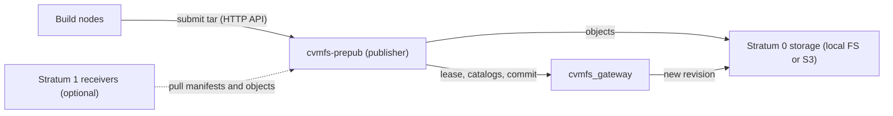

# cvmfs-prepub

cvmfs-prepub is a publishing service for [CVMFS](https://cernvm.cern.ch/fs/)
repositories. Build nodes upload a software package as a tar archive over an
HTTP API. The service unpacks, compresses, hashes and deduplicates the content
and writes it to the repository storage before it takes the repository lock.
It then builds the catalog and commits it through `cvmfs_gateway`. Stratum 1
receivers can optionally pull the new objects from the publisher, so the
replicas are warm when clients ask for the new release.

Contents: [Why](#why) · [What it does](#what-it-does) ·
[Architecture](#architecture) · [Requirements](#requirements) ·
[Quick start](#quick-start) · [Security](#security) ·
[Monitoring](#monitoring) · [Documentation](#documentation)

## Why

- With `cvmfs_server publish`, the repository lock is held while every file is
  extracted, compressed, hashed and uploaded. Publishes to the same repository
  queue behind each other, even though most of that work could run in parallel.
- After the catalog flip, every Stratum 1 replica has to fetch all new objects
  from scratch. The first clients after a release hit cold caches.

## What it does

- **Does the work before the lease.** Unpacking, zlib compression, SHA-1
  content hashing (the CVMFS content key), deduplication and upload all happen
  without a lock. The gateway lease is taken only after the upload, and the
  catalog is built natively in Go ([CATALOG.md](CATALOG.md)).
- **Offers several publish paths.** `prepub` (the default) is the pipeline
  described above. `ingest` hands the tar to `cvmfs_server ingest`. `staged`
  (gateway mode) grafts objects and a catalog that the producer has prepared.
  A local backend (`publish_mode: local`) runs `cvmfs_server` on the same
  host, with no gateway.
- **Publishes whole builds at once.** On the default path, jobs that carry a
  `build_id` accumulate, and the build is committed in one transaction when it
  is finalized.
- **Survives crashes.** Every job lives in an on-disk spool with a journal.
  After a restart, jobs resume. Retryable failures are retried with backoff
  for up to `retry_window` (24 hours by default).
- **Can pre-warm Stratum 1.** With `--prewarm`, receivers are told about a
  transaction before its commit and start pulling objects. This is best
  effort: the commit never waits for receivers.
- **Authenticates the API.** Clients send a bearer token or HMAC-signed
  requests. Signed requests mean the shared secret never travels.

## Architecture


```mermaid
flowchart LR
  B["Build nodes"] -->|"submit tar (HTTP API)"| P["cvmfs-prepub (publisher)"]
  P -->|"objects"| S["Stratum 0 storage (local FS or S3)"]
  P -->|"lease, catalogs, commit"| G["cvmfs_gateway"]
  G -->|"new revision"| S
  R["Stratum 1 receivers (optional)"] -.->|"pull manifests and objects"| P
```

The publisher and the receivers are the same binary, `cvmfs-prepub`. Receivers
connect out to the publisher; Stratum 0 never connects to a Stratum 1.

## Requirements

- Linux and Go 1.24 or later (see `go.mod`).
- **Gateway mode (production):** a `cvmfs_gateway` for the repository, write
  access to the repository storage (a local directory, or the S3 bucket named
  in the repository's `server.conf`), and the Stratum 0 HTTP URL. The default
  direct-graft commit needs a gateway with the graft endpoint; on a stock
  gateway, set `gateway.direct_graft: false`.
- **Local mode (trial or single host):** `cvmfs_server` and an existing
  repository on the same host.
- The `ingest` path needs `cvmfs_server` on the publisher; finalizing whole
  builds needs `cvmfs_swissknife` and `--ingest-config-prefix`. See
  [INSTALL.md](INSTALL.md#4-publish-backends-and-paths).

## Quick start

This is a **local trial**. It uses the local backend, which runs
`cvmfs_server transaction` and `cvmfs_server publish` on this host, so it does
not use the gateway pipeline. It needs a repository that already exists here
(for example one created with `cvmfs_server mkfs test.example.org`). Run the
service as the repository owner. For a production setup with a gateway,
follow [INSTALL.md](INSTALL.md).

Build the binary. It is written to `bin/cvmfs-prepub`:

```sh
make build
```

Write a minimal configuration, `trial.yaml`:

```yaml
publish_mode: local                    # cvmfs_server on this host; no gateway, no CAS
spool_root: /var/tmp/prepub-trial/spool
server:
  listen: "127.0.0.1:8080"
```

Start the service. It refuses to start without an API token:

```sh
export PREPUB_API_TOKEN=$(openssl rand -hex 32)
bin/cvmfs-prepub --config trial.yaml
```

In a second shell (export the same `PREPUB_API_TOKEN`), check health:

```sh
curl -s http://127.0.0.1:8080/api/v1/health
# {"status":"healthy","publish_paths":["prepub"],"auth_mode":"both",...}
```

Submit one package. `path` is relative to the repository root:

```sh
mkdir -p demo/bin && printf '#!/bin/sh\necho hello\n' > demo/bin/hello
tar -C demo -cf demo.tar .
curl -s -H "Authorization: Bearer $PREPUB_API_TOKEN" \
  -F repo=test.example.org -F path=demo/1.0 -F tar=@demo.tar \
  http://127.0.0.1:8080/api/v1/jobs
# {"job_id":"<id>"}   (HTTP 202)
curl -s -H "Authorization: Bearer $PREPUB_API_TOKEN" \
  http://127.0.0.1:8080/api/v1/jobs/<id>
# "state":"published" when done; the files appear under /cvmfs/test.example.org/demo/1.0
```

The web console at `http://127.0.0.1:8080/` lists the jobs; it asks for the
API token.

## Security

The API listener is plain HTTP. Put a TLS reverse proxy in front of it when it
is reachable beyond the host. `PREPUB_API_TOKEN` is accepted either as a bearer
token or as the key for HMAC-signed requests; `--auth-mode` (`bearer`, `both`
or `hmac`) selects which. Gateway credentials come from `CVMFS_GATEWAY_KEY_ID`
and `CVMFS_GATEWAY_SECRET`. For pre-warming, only the publisher holds the
master secret; each receiver gets its own per-node key. See
[INSTALL.md](INSTALL.md#5-api-authentication-and-secrets) and
[REFERENCE.md](REFERENCE.md#7-security-model).

## Monitoring

`GET /api/v1/health` reports status, publish paths and whether builds can be
finalized. Prometheus metrics are served at `/api/v1/metrics`; receivers serve
`/metrics` on `--control-addr`. Logs are `slog` text (`key=value`) on stderr.
See [REFERENCE.md](REFERENCE.md#9-metrics-and-logs).

## Documentation

| Document | Contents |
|---|---|
| [INSTALL.md](INSTALL.md) | Installing, deploying and operating a publisher and Stratum 1 receivers |
| [REFERENCE.md](REFERENCE.md) | Architecture, job lifecycle, configuration, REST API, distribution protocol, security, metrics |
| [CATALOG.md](CATALOG.md) | How catalogs are built and stored |
| [test/integration/gateway/README.md](test/integration/gateway/README.md) | End-to-end test against a real `cvmfs_gateway` |
